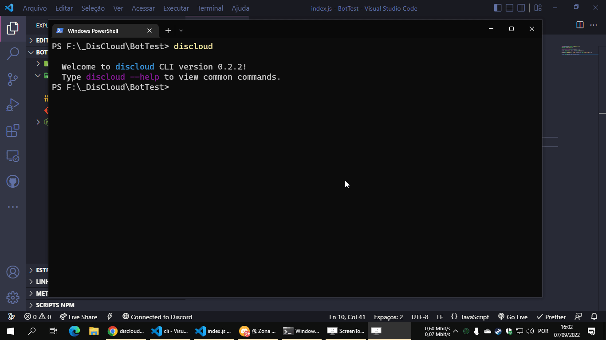
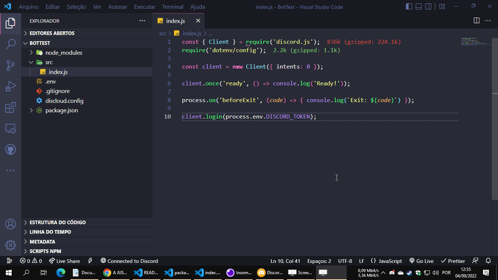

# Discloud CLI

[](https://github.com/discloud/cli/blob/main/LICENSE)
[](https://www.npmjs.com/package/discloud-cli)
[](https://www.npmjs.com/package/discloud-cli)
[](https://discloud.github.io/cli)
[](https://github.com/discloud/cli)

Discloud CLI is a quick option to control your apps in Discloud

See more of the [docs](https://discloud.github.io/cli/).

## Installation

```sh
npm i -g discloud-cli
```

To get started using this CLI, first use:

```sh
discloud login
```

[](./docs/login.md)

If your app does not contain `discloud.config`, use:

```sh
discloud init
```

[](./docs/init.md)

Do you want to send an app to discloud? Use:

```sh
discloud up
```

[](./docs/upload.md)

If you want to see all commands

```sh
discloud --help

discloud [command]

discloud app <command>                         Manage your apps
  discloud app apt <command>                   Manager your apps APT
    discloud app apt install <app> [apt...]    Install APT on your app [aliases: i]
    discloud app apt uninstall <app> [apt...]  Uninstall APT from your app [aliases: u]
  discloud app backup [app] [path]             Get backup of your app code from Discloud [aliases: bkp]
  discloud app commit <app> [glob..]           Commit one app or site to Discloud [aliases: c]
  discloud app console <app>                   Use the app terminal   [aliases: terminal]
  discloud app delete <app>                    Delete one or all of your apps on Discloud
  discloud app info [app]                      Get information of your apps
  discloud app logs [app] [path]               View the logs from application in Discloud
  discloud app mod <command>                   Manager your app team
  discloud app mod add <app> <mod> [perms...]  Add MOD to your app
  discloud app mod delete <app> <mod>          Delete MOD of your app
  discloud app mod edit <app> <mod> [perms...] Edit MOD perms of your app
  discloud app mod info <app>                  Get MOD info of your app
  discloud app ram <app> <amount>              Set amount of ram for your app
  discloud app restart [app]                   Restart one or all of your team apps on Discloud
  discloud app start [app]                     Start one or all of your apps on Discloud
  discloud app status [app]                    Get status of your apps
  discloud app stop [app]                      Stop one or all of your apps on Discloud
  discloud app upload [glob..]                 Upload one app or site to Discloud [aliases: up]
discloud init                                  Init discloud.config file
discloud login                                 Login on Discloud API
discloud team <command>                        Manage team apps
  discloud team backup [app] [path]            Get backup of your team app code from Discloud [aliases: bkp]
  discloud team commit <app> [glob..]          Commit one app or site to Discloud [aliases: c]
  discloud team info                           Get info of your team apps
  discloud team logs [app] [path]              View the logs from your tean app in Discloud
  discloud team ram <app> <amount>             Set amount of ram for your app
  discloud team restart [app]                  Restart one or all of your apps on Discloud
  discloud team start [app]                    Start one or all of your team apps on Discloud
  discloud team stop [app]                     Stop one or all of your team apps on Discloud
discloud user <command>                        Manage your profile
  discloud user info                           Get your information
  discloud user locale                         Set your locale
discloud zip [glob..]                          Make zip
```

See more of the [docs](https://discloud.github.io/cli/).
